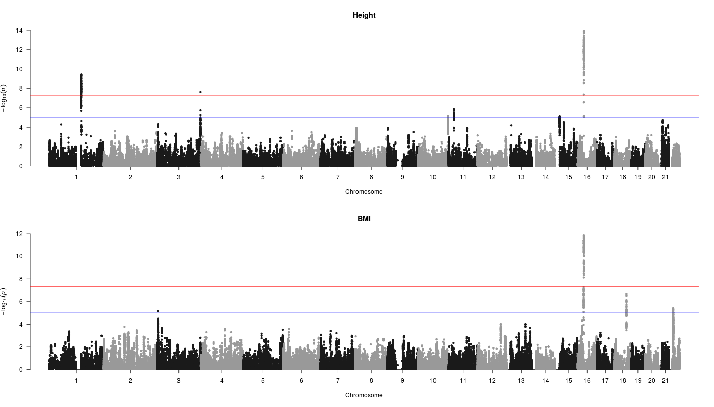
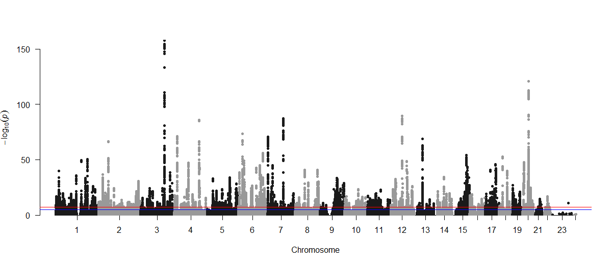
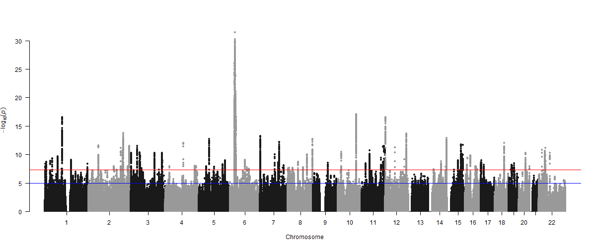
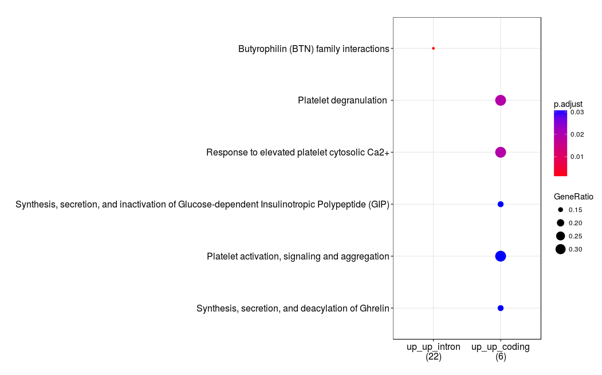
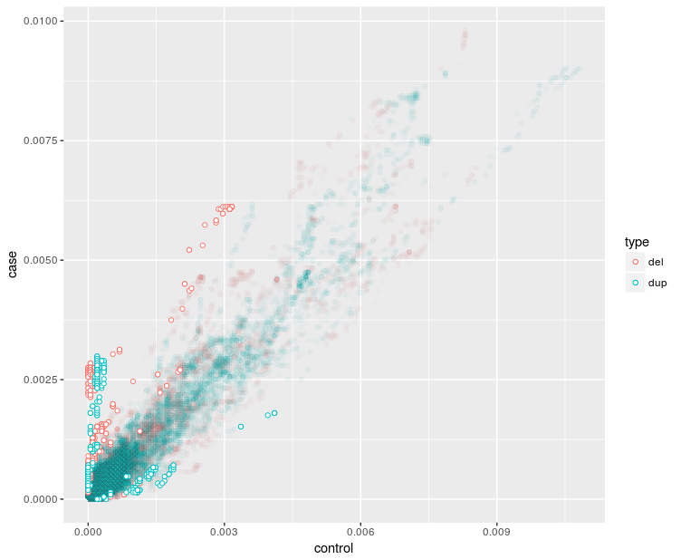
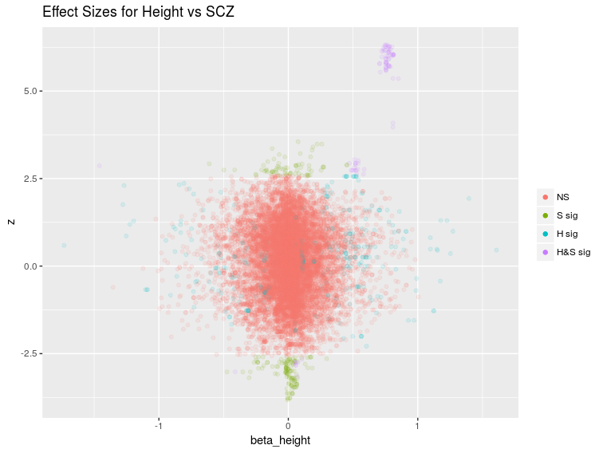

```{r setup, include=FALSE, echo=FALSE, results='hide', warning=FALSE}
knitr::opts_chunk$set(echo = FALSE)
library(here)
source(here("R","prepare.R"))
install.load("data.table", "pander")

```


Copy Number Variants GWAS 
===========================

### Recent CNV Associations

**Height, BMI, Weight, Waist Hip Ratio** [*CNV-association meta-analysis in 191,161 European adults reveals new loci associated with anthropometric traits*](https://www.nature.com/articles/s41467-017-00556-x)

191,161 adult samples from 26 cohorts.

Summary data available from supplementary information or:  <https://cnvcatalogue.bbmri.nl>


**Schizophrenia.** [Contribution of copy number variants to schizophrenia
from a genome-wide study of 41,321 subjects](https://www.nature.com/articles/ng.3725.pdf)

21,094 cases and 20,227 controls

Summary data available from the Psychiatric Genomics Consortium


Genome Wide Height and BMI
========================================================




Genome Wide Schizophrenia CNV Associations from PGC  
========================================================


Height SNP GWAS
================




SCZ SNP GWAS
============




Population Genetics
===================

The patterns and level of genetic variation in a population are 
due to the interaction between 

* *mutation*
* *drift*
* and *selection* 

With *population subdivision* and *assortative mating* adding extra layers of associaton at a site.


and recombination so that positions close on the genome tend to be alike.


CNV Burden
===================

CHD, Autism, Schizophrenia, Tourette's Syndrome, Congenital Kidney Malformation show an increased number of CNVs in cases compared to controls

The association tends to be stronger for CNVs that are 

* de-novo
* rarer
* overlap genes
* are deletions

It was shown in in the height CNV GWAS that there was a 

* $0.41$cm decrease in height 
* $0.003$ increase in waist-hip ratio 
* $0.14$ kg/m$^2$ increase in BMI

with every Mb of total deletion burden.


Questions
=========

* Is there any relationship between the variants in CNVs and SNPs?
* Is there a systematic difference between CNVs associated with Height and schizophrenia?
* What are the limits to CNV variation?
* Can these data tell us anything about the balance between mutation and seletion for deletions and duplications?


Helpful Data
=============

* ExAC
    * Has derived gene centric intolerance scores for CNVs (completely untested)
    * These scores are based on residuals after fitting a linear model for the expected number of CNVs in a gene 

* GWAS Catalog

* More GWAS summary data

### Additional Question
    
Are the CNV intolerance scores from ExaC useful?

A Paper
=======

The genetic overlap between schizophrenia and height

Schizophr Res. 2013 Dec; 151(0): 226–228.

Epidemiological studies suggest that height and schizophrenia risk are inversely correlated. These findings might arise because i) height and schizophrenia share genetic variants and ii) the effects of these shared variants are in opposite direction for the two traits. We use genome wide association data to empirically evaluate these hypotheses. We find that variants which impact on height and risk for schizophrenia \textcolor{blue}{are distributed across several genomic regions and the directions of effect vary, some consistent and others inconsistent with the direction expected from the phenotypic data}. Moreover, signals that were in and not in accord with the phenotypic data aggregated in distinct biological pathways.

Keywords:  \textcolor{red}{Suggestive Signals}, \textcolor{red}{Shrinkage}


A Paper
=======

The genetic overlap between schizophrenia and height

Schizophr Res. 2013 Dec; 151(0): 226–228.

Epidemiological studies suggest that height and schizophrenia risk are inversely correlated. These findings might arise because i) height and schizophrenia share genetic variants and ii) the effects of these shared variants are in opposite direction for the two traits. We use genome wide association data to empirically evaluate these hypotheses. We find that variants which impact on height and risk for schizophrenia are distributed across several genomic regions and the directions of effect vary, some consistent and others inconsistent with the direction expected from the phenotypic data. Moreover, \textcolor{teal}{signals that were in and not in accord with the phenotypic data aggregated in distinct biological pathways.}

Keywords:  \textcolor{red}{Suggestive Signals}, \textcolor{red}{Shrinkage}

Repeat Overlap with two Different (larger) GWAS for height and SCZ 
=========================================

```{r, echo=FALSE, cache=TRUE}
load( here("output", "both_with_GENEID.rda"))
allg <- all[LOCATION!="intergenic"]
allc <- all[LOCATION=="coding"]
alli <- all[LOCATION=="intron"]
allp <- all[LOCATION=="promoter"]

m <- table(SCZ = all$p.scz<0.0005, Height = all$p.height<0.0005)
class(m) <- "matrix"
dm <- data.frame(m)
colnames(m) <- c("Height not ", "Height Significant")
rownames(m) <- c("SCZ not significant", "SCZ Significant")
pander(m)
```
"Suggestive" p-value used is $1 \times 10^{-5}$.

There is a strong association between positive signals.


Aside:  Shrinking Z-Scores
==================

The smallest github code I have seen (comments are mine). 
<https://github.com/bacanusa/FIQT>

```{r FIQT, echo=TRUE}
FIQT <- function(z=z, min.p=10^-300){
    pvals<-2*pnorm(abs(z),low=F)            ## get p-values from z-scores
    pvals[pvals<min.p]<- min.p              ## Truncate small p values
    adj.pvals<-p.adjust(pvals,method="fdr") ## Adjust p-values for FDR
    mu.z<-sign(z)*qnorm(adj.pvals/2,low=F)  ## transform back to z-scores
    mu.z[abs(z)>qnorm(min.p/2,low=F)]<-z[abs(z)>qnorm(min.p/2,low=F)]  ## give extreme scores a truncated value
    mu.z
}
```
This code is the basis of a *bioinformatics* paper.

A simple yet accurate correction for winner's curse can predict signals discovered in much larger genome scans.  Begdeli *et al.*. Bioinformatics. 2016.


Using Shrunken Z-Scores
=======================


```{r}

m <- table( SCZ = ((all$z.scz< -3) | (all$z.scz > 3)), Height = ((all$z.height< -3)|(all$z.height>3)))
class(m) <- "matrix"
dm <- data.frame(m)
colnames(dm) <- c( "Height not Suggestive", "Height Suggestive (|z| > 3)")
rownames(dm) <- c( "SCZ not Suggestive", "SCZ Suggestive (|z| > 3)")
pander(dm, "Test for association, p<1e-16")

```
```{r}
install.load("pander")
allb <- all[((z.scz< -3) | (all$z.scz > 3)) & ((all$z.height< -3)|(all$z.height>3))]
m <- table( SCZ = (allb$z.scz< -3) , Height = (allb$z.height< -3))
class(m) <- "matrix"
dm <- data.frame(m)
colnames(dm) <- c("Height z > 3", "Height z < -3")
rownames(dm) <- c("SCZ z > 3", "SCZ z < -3")
pander(dm, caption=paste0("All gene associated \'suggestive\' SNPs. p=",signif(chisq.test(m)$p.value,2)))
```

Coding Or Intronic
=======

```{r}
allb <- allc[((z.scz< -3) | (allc$z.scz > 3)) & ((allc$z.height< -3)|(allc$z.height>3))]
m <- table( SCZ = (allb$z.scz< -3) , Height = (allb$z.height< -3))
class(m) <- "matrix"
dm <- data.frame(m)
colnames(dm) <- c("Height z > 3", "Height z < -3")
rownames(dm) <- c("SCZ z > 3", "SCZ z < -3")
pander(dm, caption=paste0("Coding SNPs, p=" ,signif(fisher.test(m)$p.value,2)))

allb <- alli[((z.scz< -3) | (z.scz > 3)) & ((z.height< -3)|(z.height>3))]
m <- table( SCZ = (allb$z.scz< -3) , Height = (allb$z.height< -3))
class(m) <- "matrix"
dm <- data.frame(m)
colnames(dm) <- c("Height z > 3", "Height z < -3")
rownames(dm) <- c("SCZ z > 3", "SCZ z < -3")
pander(dm, caption=paste0("Intronic SNPs, p=", signif(fisher.test(m)$p.value,2)))

```

SNPs in 5' UTR, 3'UTR and Promoter Regions 
========================
```{r}
allp2 <- all[LOCATION %in% c("fiveUTR", "threeUTR","promoter")]
allb <- allp2[((z.scz< -3) | (z.scz > 3)) & ((z.height< -3)|(z.height>3))]
m <- table( SCZ = (allb$z.scz< -3) , Height = (allb$z.height< -3))
class(m) <- "matrix"
dm <- data.frame(m)
colnames(dm) <- c("Height z > 3", "Height z < -3")
rownames(dm) <- c("SCZ z > 3", "SCZ z < -3")
pander(dm, caption=paste0("Promoter SNPs, p=", round(chisq.test(m)$p.value,2)))
```


Pathways via ReactomePA R Library
========





CNV Analyses
============



Height and SCZ Effect Sizes
=============




ExAc Scores 
==========================

Positive scores indicate genes that are more intolerant to mutations.
 
 stat |SCZ deletion Genes | non SCZ Genes |  
---|----------|---------------|--
n  | 72 | 276
deletion scores | -2.12 | -1.92| p=0.11
single gene deletion | 0.12 | -0.85 | p=2e-6
duplication scores | -1.66 | -1.16 | p=0.001
single gene duplication | 0.23 | -0.37 | p=0.0008


 stat |Height deletion Genes | non Height Genes |  
---|----------|---------------|--
n  | 26 | 1926
deletion scores | -1.73 | -0.30| p=1e-9
single gene deletion | 0.0 | -0.16 | p=0.52
duplication scores | -1.54 | -0.57 | p=1.6e-5
single gene duplication |  0.2 | -0.2 | p=0.12


Conclusion
===========

More work needed