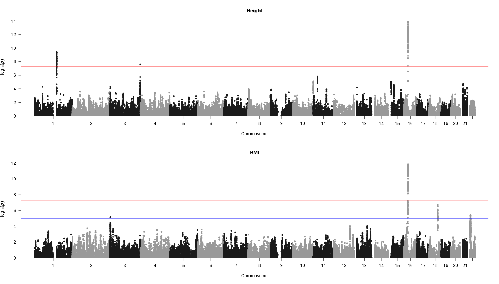
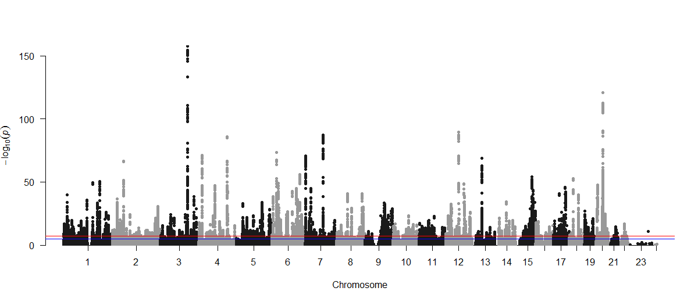
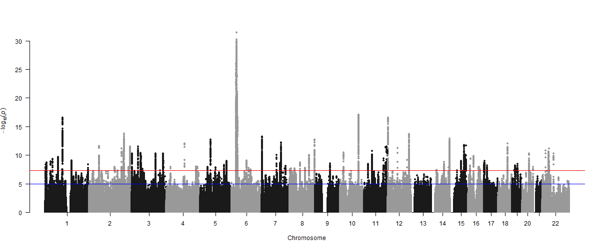
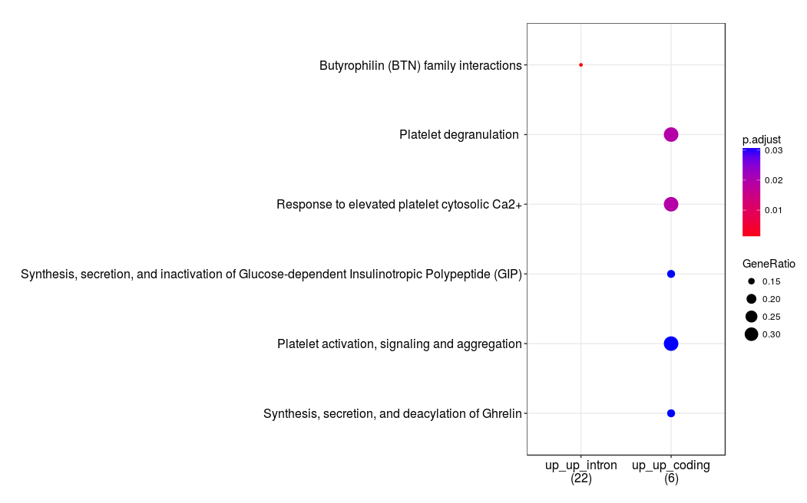
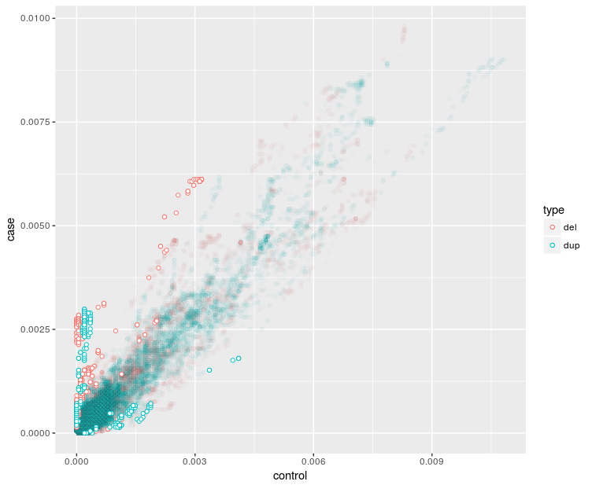
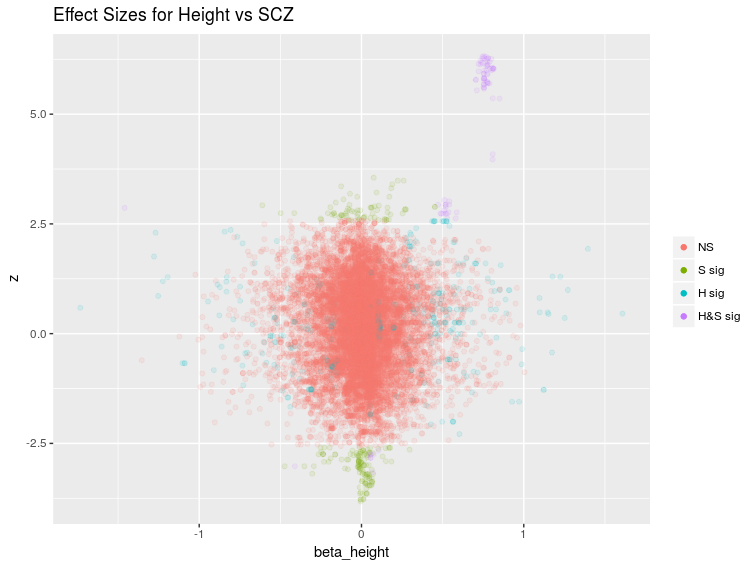

```{r setup, include=FALSE, echo=FALSE, results='hide'}
knitr::opts_chunk$set(echo = FALSE)
library(here)
source(here("R","prepare.R"))
install.load("data.table", "pander")

```


Genome Wide Height and BMI
========================================================


```{r prepare, echo=FALSE, results='hide', message=FALSE, warning=FALSE}
library(here)
source(here("R","prepare.R"))
```




Genome Wide Schizophrenia CNV Associations from PGC  
========================================================


Height SNP GWAS
================




SCZ SNP GWAS
============



GWAS Associations
===================


CNV Datasets
============


Population Genetics
===================

The patterns and level of genetic variation in a population are 
due to the interaction between 

* mutation
* drift
* and selection

With some population subdivision and assortative mating to add extra layers of associaton at a site,

and recombination so that positions close on the genome tend to be alike.


CNV Burden
===================

CHD, Autism, Schizophrenia, Tourette's Syndrome, Congenital Kidney Malformation show an increased number of CNVs in cases compared to controls

The association tends to be stronger for CNVs that are 

* de-novo
* rarer
* overlap genes
* are deletions

It was shown in in the height CNV GWAS that there was a 

* $0.41$cm decrease in height 
* $0.003$ increase in waist-hip ratio 
* $0.14$ kg/m$^2$ increase in BMI

with every Mb of total deletion burden.


Questions
=========

* Are the variants in CNVs and SNPs in the same genes?
* What are the limits to CNV variation?
* Is there a systematic difference between CNVs associated with Height and schizophrenia?


Helpful Data
=============

* ExAC
    * Has derived gene centric intolerance scores for CNVs (completely untested)
    * These scores are based on residuals after fitting a linear model for the expected number of CNVs in a gene 

* GWAS Catalog

* More GWAS summary data

### Additional Question
    
Are the CNV intolerance scores from ExaC useful?

A Paper
=======

The genetic overlap between schizophrenia and height

Schizophr Res. 2013 Dec; 151(0): 226–228.

Epidemiological studies suggest that height and schizophrenia risk are inversely correlated. These findings might arise because i) height and schizophrenia share genetic variants and ii) the effects of these shared variants are in opposite direction for the two traits. We use genome wide association data to empirically evaluate these hypotheses. We find that variants which impact on height and risk for schizophrenia \textcolor{blue}{are distributed across several genomic regions and the directions of effect vary, some consistent and others inconsistent with the direction expected from the phenotypic data}. Moreover, signals that were in and not in accord with the phenotypic data aggregated in distinct biological pathways.

Keywords:  \textcolor{red}{Suggestive Signals}, \textcolor{red}{Shrinkage}


A Paper
=======

The genetic overlap between schizophrenia and height

Schizophr Res. 2013 Dec; 151(0): 226–228.

Epidemiological studies suggest that height and schizophrenia risk are inversely correlated. These findings might arise because i) height and schizophrenia share genetic variants and ii) the effects of these shared variants are in opposite direction for the two traits. We use genome wide association data to empirically evaluate these hypotheses. We find that variants which impact on height and risk for schizophrenia are distributed across several genomic regions and the directions of effect vary, some consistent and others inconsistent with the direction expected from the phenotypic data. Moreover, \textcolor{teal}{signals that were in and not in accord with the phenotypic data aggregated in distinct biological pathways.}

Keywords:  \textcolor{red}{Suggestive Signals}, \textcolor{red}{Shrinkage}

Repeat Overlap with two Different Studies
=================

```{r, echo=FALSE, cache=TRUE}
load( here("output", "both_with_GENEID.rda"))
allg <- all[LOCATION!="intergenic"]
allc <- all[LOCATION=="coding"]
alli <- all[LOCATION=="intron"]
allp <- all[LOCATION=="promoter"]

m <- table(SCZ = all$p.scz<0.0005, Height = all$p.height<0.0005)
class(m) <- "matrix"
dm <- data.frame(m)
colnames(m) <- c("Height Significant", "Height NS")
rownames(m) <- c("SCZ significant", "SCZ NS")
pander(m)
```
"Suggestive" p-value used is $1 \times 10^{-5}$.

There is a strong association between positive signals.

Using Shrunk Z-Scores
==============


```{r}

m <- table( SCZ = ((all$z.scz< -3) | (all$z.scz > 3)), Height = ((all$z.height< -3)|(all$z.height>3)))
class(m) <- "matrix"
dm <- data.frame(m)
colnames(dm) <- c("Height Suggestive (|z| > 3)", "Height NS")
rownames(dm) <- c("SCZ Suggestive (|z| > 3)", "SCZ NS")
pander(dm, "Test for association, p<1e-16")

```
```{r}
install.load("pander")
allb <- all[((z.scz< -3) | (all$z.scz > 3)) & ((all$z.height< -3)|(all$z.height>3))]
m <- table( SCZ = (allb$z.scz< -3) , Height = (allb$z.height< -3))
class(m) <- "matrix"
dm <- data.frame(m)
colnames(dm) <- c("Height z > 3", "Height z < -3")
rownames(dm) <- c("SCZ z > 3", "SCZ z < -3")
pander(dm, caption=paste0("All gene associated \'suggestive\' SNPs. p=",signif(chisq.test(m)$p.value,2)))
```

Coding Or Intronic
=======

```{r}
allb <- allc[((z.scz< -3) | (allc$z.scz > 3)) & ((allc$z.height< -3)|(allc$z.height>3))]
m <- table( SCZ = (allb$z.scz< -3) , Height = (allb$z.height< -3))
class(m) <- "matrix"
dm <- data.frame(m)
colnames(dm) <- c("Height z > 3", "Height z < -3")
rownames(dm) <- c("SCZ z > 3", "SCZ z < -3")
pander(dm, caption=paste0("Coding SNPs, p=" ,signif(fisher.test(m)$p.value,2)))

allb <- alli[((z.scz< -3) | (z.scz > 3)) & ((z.height< -3)|(z.height>3))]
m <- table( SCZ = (allb$z.scz< -3) , Height = (allb$z.height< -3))
class(m) <- "matrix"
dm <- data.frame(m)
colnames(dm) <- c("Height z > 3", "Height z < -3")
rownames(dm) <- c("SCZ z > 3", "SCZ z < -3")
pander(dm, caption=paste0("Intronic SNPs, p=", signif(fisher.test(m)$p.value,2)))

```

SNPs in 5' UTR, 3'UTR and Promoter Regions 
========================
```{r}
allp2 <- all[LOCATION %in% c("fiveUTR", "threeUTR","promoter")]
allb <- allp2[((z.scz< -3) | (z.scz > 3)) & ((z.height< -3)|(z.height>3))]
m <- table( SCZ = (allb$z.scz< -3) , Height = (allb$z.height< -3))
class(m) <- "matrix"
dm <- data.frame(m)
colnames(dm) <- c("Height z > 3", "Height z < -3")
rownames(dm) <- c("SCZ z > 3", "SCZ z < -3")
pander(dm, caption=paste0("Promoter SNPs, p=", round(chisq.test(m)$p.value,2)))
```


Pathways via ReactomePA R Library
========





CNV Analyses
============



Height and SCZ Effect Sizes
=============




Presentation
========================================================

For more details on authoring R presentations please visit <https://support.rstudio.com/hc/en-us/articles/200486468>.


